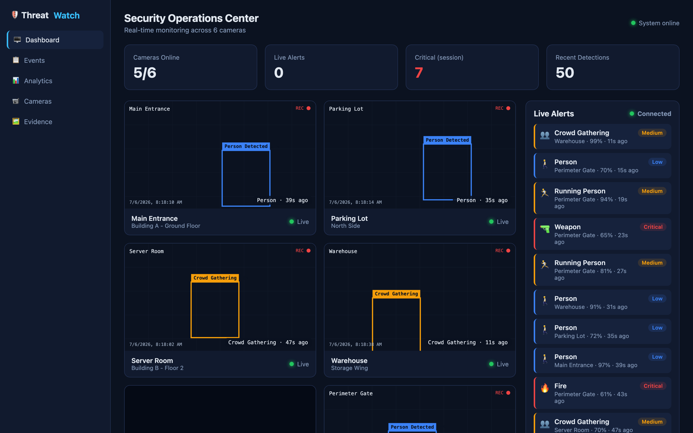
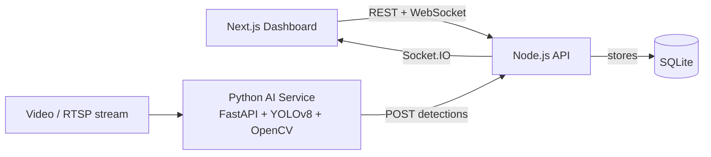

# ThreatWatch-AI

A real-time CCTV threat detection system that watches camera feeds, flags suspicious
activity using computer vision, and surfaces everything on a security operations
dashboard. Built as a full-stack project combining a Next.js dashboard, a Node.js
API with live WebSocket alerts, and a Python detection service running YOLOv8.



## Features

- **Live operations dashboard** – multi-camera grid, streaming alert feed, and at-a-glance stats
- **Multi-threat detection** – person, weapon, knife, fire, intrusion, crowd gathering, and running person
- **Real-time notifications** – WebSocket alerts, browser notifications, alert sound, and severity levels
- **Event management** – searchable and filterable event log with CSV export
- **Camera management** – add/remove cameras, toggle status, simulated RTSP support
- **Evidence gallery** – captured frames for every detection with an event timeline
- **Analytics** – detections by type, severity breakdown, and 24-hour activity chart
- **Demo mode** – a built-in traffic simulator so the whole system runs without a camera or GPU

## Architecture



The detection service reads frames with OpenCV, runs them through YOLOv8, and posts any
threats to the Node backend. The backend stores each detection in SQLite and pushes a
live alert to every connected dashboard over Socket.IO.

## Tech Stack

| Layer          | Technology                          |
| -------------- | ----------------------------------- |
| Frontend       | Next.js 14 (App Router), React      |
| Backend API    | Node.js, Express, Socket.IO         |
| Database       | SQLite (better-sqlite3)             |
| AI Service     | Python, FastAPI, YOLOv8, OpenCV     |

## Database

The system stores cameras and detection events in SQLite (via `better-sqlite3`). The
schema is created automatically on first run and seeded with `npm run seed`. Two tables
back the whole app — `cameras` and `events` — with severity derived from each threat
type. See [docs/database.md](docs/database.md) for the full schema and an ER diagram.

## Project Structure

```
ThreatWatch-AI/
├── frontend/          Next.js dashboard
│   ├── app/           pages: dashboard, events, analytics, cameras, evidence
│   ├── components/    Sidebar, CameraPanel, AlertFeed, Badge
│   └── lib/           api client, socket hook, threat metadata
├── backend/           Express + Socket.IO API
│   └── src/
│       ├── routes/    cameras, events, evidence, analytics, ingest
│       ├── server.js  app entry
│       ├── db.js      SQLite schema
│       ├── simulator.js  demo traffic generator
│       └── seed.js    sample data
├── ai-service/        FastAPI detection service
│   ├── main.py        API + frame processing queue
│   └── detector.py    YOLOv8 wrapper and threat mapping
└── docs/              screenshots and notes
```

## Getting Started

### 1. Backend (API + WebSocket)

```bash
cd backend
npm install
cp .env.example .env
npm run seed      # loads sample cameras and events
npm run dev
```

The API runs on `http://localhost:4000`. With `DEMO_MODE=true` (the default) it starts
generating sample detections immediately, so you can demo the whole app with just this
service and the frontend.

### 2. Frontend (Dashboard)

```bash
cd frontend
npm install
cp .env.local.example .env.local
npm run dev
```

Open `http://localhost:3000`.

### 3. AI Service (optional – real detection)

The detection service is only needed to analyse real footage. Use Python 3.10–3.12.

```bash
cd ai-service
python -m venv venv
source venv/bin/activate
pip install -r requirements.txt
uvicorn main:app --port 8000
```

Then send a video to be analysed:

```bash
curl -F "camera_id=1" -F "file=@samples/clip.mp4" http://localhost:8000/process
```

Detected threats are posted to the backend and appear live on the dashboard. Drop your
own `.mp4` files into `ai-service/samples/` to test. The default model (`yolov8n.pt`,
downloaded on first run) detects people and knives out of the box; weapon and fire
detection require custom-trained weights set via the `MODEL_PATH` environment variable.

## Demo Mode

Because this is a demo project, you don't need cameras or a GPU. Leave `DEMO_MODE=true`
in the backend `.env` and the simulator produces a realistic stream of detections across
the sample cameras, complete with generated evidence frames. Set it to `false` when you
want to feed in real footage through the AI service.

## API Overview

| Method | Endpoint                       | Description                    |
| ------ | ------------------------------ | ------------------------------ |
| GET    | `/api/cameras`                 | List cameras                   |
| POST   | `/api/cameras`                 | Add a camera                   |
| PATCH  | `/api/cameras/:id/status`      | Set online/offline             |
| DELETE | `/api/cameras/:id`             | Remove a camera                |
| GET    | `/api/events`                  | List events (filter + search)  |
| GET    | `/api/events/export`           | Export events as CSV           |
| PATCH  | `/api/events/:id/acknowledge`  | Acknowledge an event           |
| GET    | `/api/evidence`                | Captured frames for the gallery|
| GET    | `/api/analytics/summary`       | Dashboard metrics              |
| POST   | `/api/ingest`                  | Detection intake (AI service)  |

The backend also emits an `alert` event over Socket.IO for every new detection.

## Future Improvements

- Custom-trained weapon and fire detection models
- Zone drawing to define restricted areas per camera
- User authentication and roles for the dashboard
- Video recording and clip playback around each event
- Email / Telegram notifications for critical alerts

## License

MIT © Abhijeet
