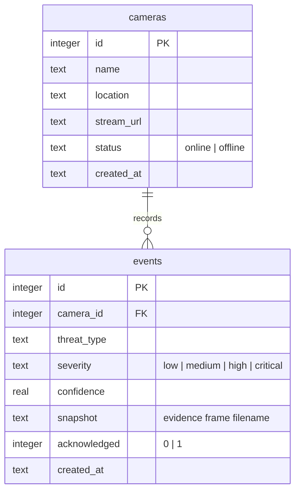

# Database

ThreatWatch-AI uses SQLite through the `better-sqlite3` driver. The schema is created
automatically on first run from `backend/src/db.js`, and `npm run seed` fills it with
sample cameras and events. The database file (`backend/threatwatch.db`) is generated at
runtime and is not committed to the repository.

## Schema

## Tables

### cameras

| Column       | Type    | Notes                                  |
| ------------ | ------- | -------------------------------------- |
| id           | INTEGER | Primary key, auto-increment            |
| name         | TEXT    | Display name, required                 |
| location     | TEXT    | Where the camera is mounted            |
| stream_url   | TEXT    | RTSP/HTTP source (simulated in demo)   |
| status       | TEXT    | `online` or `offline`                  |
| created_at   | TEXT    | Timestamp, defaults to `datetime('now')` |

### events

| Column        | Type    | Notes                                        |
| ------------- | ------- | -------------------------------------------- |
| id            | INTEGER | Primary key, auto-increment                  |
| camera_id     | INTEGER | Foreign key → `cameras.id`                   |
| threat_type   | TEXT    | person, crowd, running, intrusion, fire, knife, weapon |
| severity      | TEXT    | Derived from the threat type                 |
| confidence    | REAL    | Detection confidence, 0–1                    |
| snapshot      | TEXT    | Filename of the captured evidence frame      |
| acknowledged  | INTEGER | 0 until an operator acknowledges the event   |
| created_at    | TEXT    | Timestamp, defaults to `datetime('now')`     |

Indexes are created on `events.created_at` and `events.threat_type` to keep the event
log and analytics queries fast.

## Severity mapping

Severity is not stored by hand; it is derived from the threat type when an event is
recorded (`backend/src/threats.js`):

| Threat                | Severity |
| --------------------- | -------- |
| weapon, knife, fire   | critical |
| intrusion             | high     |
| crowd, running        | medium   |
| person                | low      |

## Moving to PostgreSQL

The data layer is small and isolated in `backend/src/db.js` and the route files, so
switching to PostgreSQL mainly means swapping the driver and adjusting the few
`datetime('now')` calls. SQLite keeps the project zero-config for a demo.
